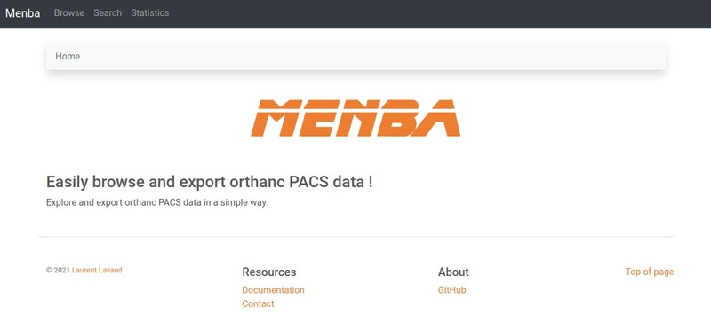
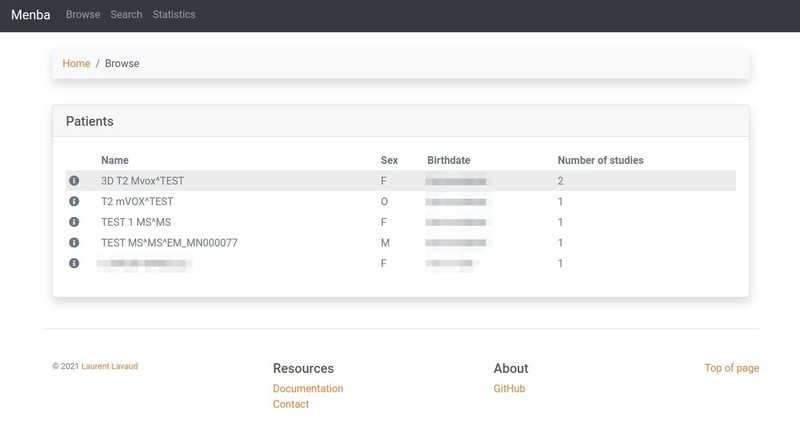
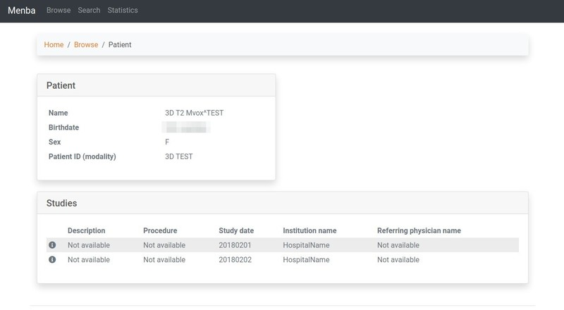
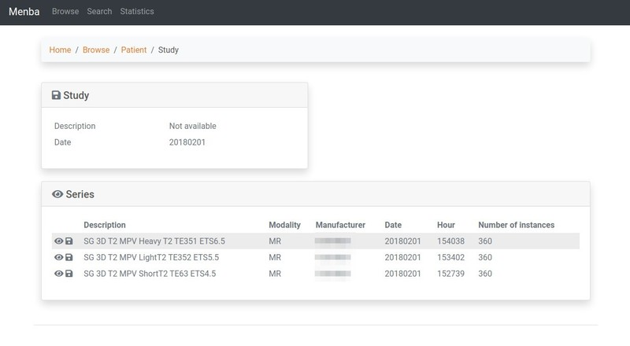
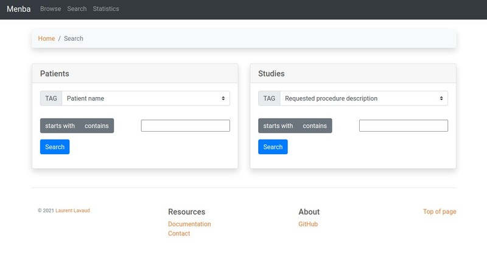
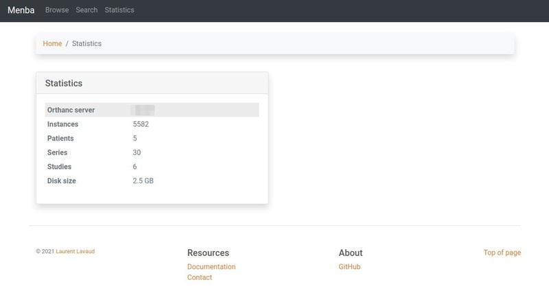
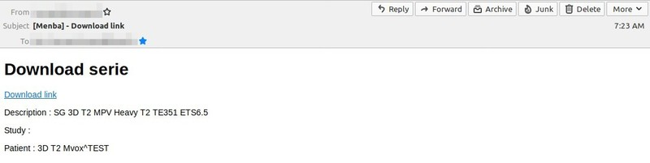

# Menba

## Easily browse and export orthanc PACS data !

This projects provides another way to browse and download [orthanc](https://www.orthanc-server.com) data.

Written in python and django framework, for use under linux (not tested but should work under *BSD).

## Features

- connect to an existing [orthanc server](https://www.orthanc-server.com)
- browse data (patients/studies/series)
- search data (patients/studies)
- retrieve archives of data (studies/series) via a download link sent by email for security reasons
- view (externally) studies via [stone of orthanc](https://www.orthanc-server.com/static.php?page=stone) and series via [orthanc web viewer](https://www.orthanc-server.com/static.php?page=web-viewer)
- print some statistics about orthanc server
- localization of pages

## Screenshots

More screenshots [above](#more-screenshots).

## Prerequisites

- a linux server (tested with ubuntu distro but should work with any distro)
- an orthanc server with
  - [stone of orthanc](https://www.orthanc-server.com/static.php?page=stone) and [web viewer](https://www.orthanc-server.com/static.php?page=web-viewer) installed
  - apis (GET) activated

## Installation

### Short way

1. install your distribution's version of apache or nginx
2. install the django framework (see [https://www.djangoproject.com/](https://www.djangoproject.com/)) with apache or nginx integration
3. install celery distributed task queue (see [https://docs.celeryproject.org/en/stable/index.html](https://docs.celeryproject.org/en/stable/index.html)) and connect it to an existing amqp broker (or deploy your own)
4. create a specific account
5. download Menba source code and deploy it under this account in a specific location
6. adapt menba/settings.py.sample, menba/wsgi.py.sample, common/config.py.sample and remove '.sample' extension

### Long way

See [INSTALL.md](./INSTALL.md) file for an "all in one" deployment.

## Security

Protect your data by hardening apache or ngnix access to, at least, /view, /search and /admin urls.

## Licensing

Menba code is licenced under [GPLv3+](https://www.gnu.org/licenses/gpl-3.0.en.html) license (content in COPYING file).

## More screenshots

### First level of data browsing

### Patient view

### Study view

### Search view

### Infos about orthanc server

### Received email to download an archive series

